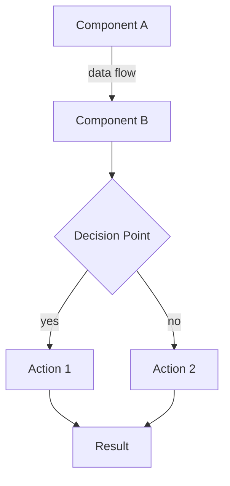
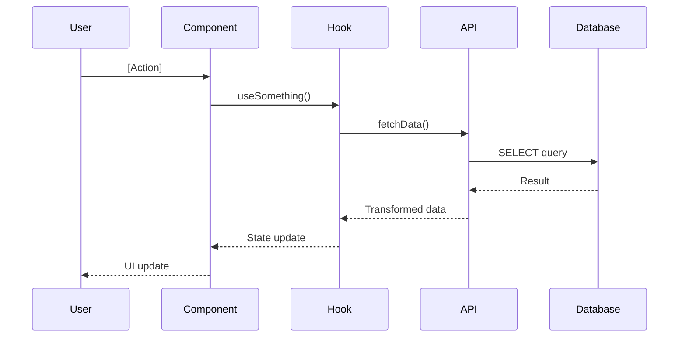

# [System Name] — Architecture

**System**: [Name]  
**Last Updated**: [Date]  
**Status**: [Active/Deprecated/Planned]  
**Est. Reading**: 1,000 lines, 2,500 tokens, 4 minutes

---

## Purpose

Deep dive into **[system name]** architecture. Read this when:
- Debugging issues in this system
- Adding features to this system
- Understanding data flows
- Planning refactors

**Related Docs**:
- [00-MASTER-INDEX](./00-MASTER-INDEX.md) — Navigation
- [01-PROJECT-STATE](./01-PROJECT-STATE.md) — Current metrics
- [XX-FEATURE-STATUS](./XX-FEATURE-STATUS.md) — What's built

---

## System Overview

**What it does**: [1-2 sentence description]

**Key responsibilities**:
- [Responsibility 1]
- [Responsibility 2]
- [Responsibility 3]

**Does NOT do** (common misconceptions):
- [What it doesn't do]
- [What it doesn't do]

---

## Architecture Diagram



**Diagram Key**:
- **Rectangles** — Components/modules
- **Diamonds** — Decision points
- **Arrows** — Data flow direction
- **Dotted lines** — Async operations

---

## File Structure

```
[system-folder]/
├── index.ts                    # Public API exports
├── types.ts                    # TypeScript interfaces
├── components/
│   ├── [Component1].tsx        # [description]
│   ├── [Component2].tsx        # [description]
│   └── ...
├── hooks/
│   ├── use[Hook1].ts           # [description]
│   ├── use[Hook2].ts           # [description]
│   └── ...
├── api/
│   ├── [api1].ts               # [description]
│   ├── [api2].ts               # [description]
│   └── ...
├── utils/
│   ├── [helper1].ts            # [description]
│   └── [helper2].ts            # [description]
└── __tests__/
    ├── [test-file].spec.ts
    └── ...
```

**Key files** (read these first):
1. `index.ts` — Public API, understand what's exported
2. `types.ts` — All interfaces, understand data models
3. `hooks/use[MainHook].ts` — Core business logic

---

## Data Models

### Types

```typescript
interface [Model] {
  id: string;
  [field]: [type];
  [field]: [type];
  [field?]: [type]; // Optional
  [field]: [type][];  // Array
}

interface [AnotherModel] {
  // ...
}
```

### Database Schema (if applicable)

**Table**: `[table-name]`

| Column | Type | Constraints | Purpose |
|--------|------|-------------|---------|
| id | uuid | PRIMARY KEY | Unique identifier |
| [column] | [type] | [constraints] | [description] |
| [column] | [type] | [constraints] | [description] |
| created_at | timestamptz | NOT NULL | Record creation |
| updated_at | timestamptz | NOT NULL | Last update |

**Indexes**:
- `idx_[name]` on `([column])` — [purpose]
- `idx_[name]` on `([column], [column])` — [purpose]

**Foreign Keys**:
- `[fk_name]` → `[other-table](id)` — [relationship description]

**RLS Policies**:
- `[policy-name]` — [description of who can do what]

---

## Data Flow

### Flow Diagram



### Step-by-Step Flow

1. **User action**: [What triggers the flow]
   - Component: `[Component.tsx]`
   - Event: `[onClick, onChange, etc.]`

2. **State update**: [How state changes]
   - Hook: `[useHook.ts]`
   - Function: `[function-name]()`

3. **API call**: [What gets fetched/saved]
   - API file: `[api.ts]`
   - Endpoint: `[URL or function name]`
   - Payload: `{ [data] }`

4. **Database operation**: [What SQL runs]
   - Table: `[table-name]`
   - Operation: `SELECT/INSERT/UPDATE/DELETE`
   - Filters: `WHERE [conditions]`

5. **Response handling**: [How data comes back]
   - Transform: `[mapping function]`
   - Cache: `[caching strategy]`
   - State: `[state variable updated]`

6. **UI update**: [What user sees]
   - Component re-renders with new data
   - Loading state cleared
   - Error shown if failed

---

## Components

### Component Hierarchy

```
[Root Component]
├── [Child Component 1]
│   ├── [Grandchild 1a]
│   └── [Grandchild 1b]
├── [Child Component 2]
│   ├── [Grandchild 2a]
│   └── [Grandchild 2b]
└── [Child Component 3]
```

### Key Components

#### [Component Name]

**File**: `[path/to/Component.tsx]`  
**Purpose**: [What it does]  
**Props**:

```typescript
interface [Component]Props {
  [prop]: [type]; // [description]
  [prop]: [type]; // [description]
  [prop?]: [type]; // [description] (optional)
  on[Event]: ([params]) => void; // [description]
}
```

**State**:
- `[state]` (type: `[type]`) — [what it tracks]
- `[state]` (type: `[type]`) — [what it tracks]

**Hooks used**:
- `use[Hook]` — [why]
- `use[Hook]` — [why]

**Renders**: [What UI it produces]

**Example usage**:

```tsx
<ComponentName
  prop1={value}
  prop2={value}
  onEvent={(data) => handleEvent(data)}
/>
```

---

## Hooks

### [Hook Name]

**File**: `[hooks/useHook.ts]`  
**Purpose**: [What business logic it handles]

**Parameters**:

```typescript
function use[Hook]([param]: [type]): [ReturnType] {
  // ...
}
```

**Returns**:

```typescript
interface [Hook]Return {
  [field]: [type]; // [description]
  [field]: [type]; // [description]
  [method]: ([params]) => [returnType]; // [description]
}
```

**Internal state**:
- `[state]` — [what it tracks]
- `[state]` — [what it tracks]

**Side effects**:
- `useEffect` on `[[dependencies]]` — [what it does]
- `useEffect` on `[[dependencies]]` — [what it does]

**Example usage**:

```typescript
const { data, loading, error, refetch } = use[Hook](param);

if (loading) return <Spinner />;
if (error) return <Error message={error} />;
return <Display data={data} />;
```

---

## API Layer

### [API Function]

**File**: `[api/api.ts]`  
**Purpose**: [What it fetches/saves]

```typescript
async function [apiFunction]([params]: [type]): Promise<[ReturnType]> {
  const { data, error } = await supabase
    .from('[table]')
    .[operation]([payload]);

  if (error) throw error;
  return [transform](data);
}
```

**Supabase operation**:
- Table: `[table-name]`
- Method: `[select/insert/update/upsert/delete]`
- Filters: `[.eq(), .in(), .gte(), etc.]`

**Error handling**:
- Throws: `[error-type]` if `[condition]`
- Returns: `null` if `[condition]`

**Caching** (if applicable):
- React Query key: `['[key]', [param]]`
- Stale time: `[X] minutes`
- Revalidate on: `[events]`

---

## State Management

**Primary pattern**: [Context/React Query/Local State]

### [Context Name] (if context used)

**File**: `[contexts/Context.tsx]`  
**Provides**:

```typescript
interface [Context]Value {
  [field]: [type];
  [method]: ([params]) => void;
}
```

**Usage**:

```typescript
const { field, method } = use[Context]();
```

### React Query (if used)

**Queries**:
- `use[Query]` — Key: `['[key]']`, Fetches: `[api-function]`
- `use[Query]` — Key: `['[key]']`, Fetches: `[api-function]`

**Mutations**:
- `use[Mutation]` — Updates: `[table]`, Invalidates: `['[query-key]']`

---

## Testing Strategy

### Unit Tests

**Files tested**:
- `[file].spec.ts` — Tests `[function/component]`
- `[file].spec.ts` — Tests `[function/component]`

**Coverage target**: ≥80%

### E2E Tests (20x Framework)

**Quality gates**:
- `npm run discover:routes` — Ensures routes for this system are discovered
- `npm run test:health` — Validates routes load correctly
- `npm run audit:a11y` — WCAG compliance for this system's UI

**Journey tests** (Layer 3):
- `[journey].spec.ts` — Tests [user flow description]

**Artifacts**:
- `e2e/fixtures/route-manifest.json` — [what routes]
- `reports/[system]-audit.json` — [what's audited]

---

## Known Issues & Gotchas

### Issue 1: [Title]

**Problem**: [Description]

**Symptoms**:
- [What user sees]
- [Error message]

**Root cause**: [Technical explanation]

**Workaround**:

```typescript
// Do this instead:
[code example]
```

**Fix required**: [What needs to change]

**Related issue**: #[issue-number]

### Issue 2: [Title]

[Same structure as above]

---

## Performance Considerations

**Known bottlenecks**:
- [Operation] — Takes [X]ms with [Y] items
- [Component] — Re-renders frequently due to [reason]

**Optimizations applied**:
- `useMemo` on `[[dependencies]]` — [what it memoizes]
- `useCallback` on `[[dependencies]]` — [what it memoizes]
- React Query caching — [what's cached, for how long]

**Future optimizations**:
- [ ] [Optimization idea] — Would reduce [metric] by [X%]
- [ ] [Optimization idea] — Would reduce [metric] by [X%]

---

## Migration History

**v1 → v2** ([Date])
- Changed: [What changed]
- Reason: [Why changed]
- Breaking: [What broke]
- Migration guide: [Link or description]

**v2 → v3** ([Date])
- [Same structure]

---

## Future Enhancements

**Planned** (in roadmap):
- [ ] [Enhancement] — [Description, expected impact]
- [ ] [Enhancement] — [Description, expected impact]

**Under consideration**:
- [ ] [Idea] — [Description, pros/cons]

---

## Related Systems

**Depends on**:
- [System name] — [What it provides]
- [System name] — [What it provides]

**Used by**:
- [System name] — [How it's used]
- [System name] — [How it's used]

**Integrates with**:
- [External service] — [Purpose]
- [External service] — [Purpose]

---

## Troubleshooting

### Problem: [Common issue]

**Symptoms**: [What you see]

**Check**:
1. [First thing to check]
2. [Second thing to check]
3. [Third thing to check]

**Fix**:

```bash
# Run this:
[command]

# Or this:
[command]
```

**If still broken**: [Escalation path]

---

## Agent Handoff Context

**If you're debugging this system**:
1. Read "Data Flow" section (understand how data moves)
2. Read "Known Issues" section (don't repeat mistakes)
3. Check `01-PROJECT-STATE.md` for current quality gate status
4. Run `npm run audit:[relevant-gate]` to see current state

**If you're adding a feature**:
1. Read "Components" section (understand hierarchy)
2. Read "Hooks" section (understand business logic)
3. Read "Future Enhancements" (check if already planned)
4. Follow "Testing Strategy" when implementing

**Estimated token cost**: 2,500 tokens (this doc, 4 min)

---

**Max Lines**: 1,000 (manually enforced)  
**Format**: Markdown + Mermaid diagrams  
**Frequency**: Update when architecture changes  
**Token Cost**: ~2,500 tokens per read
