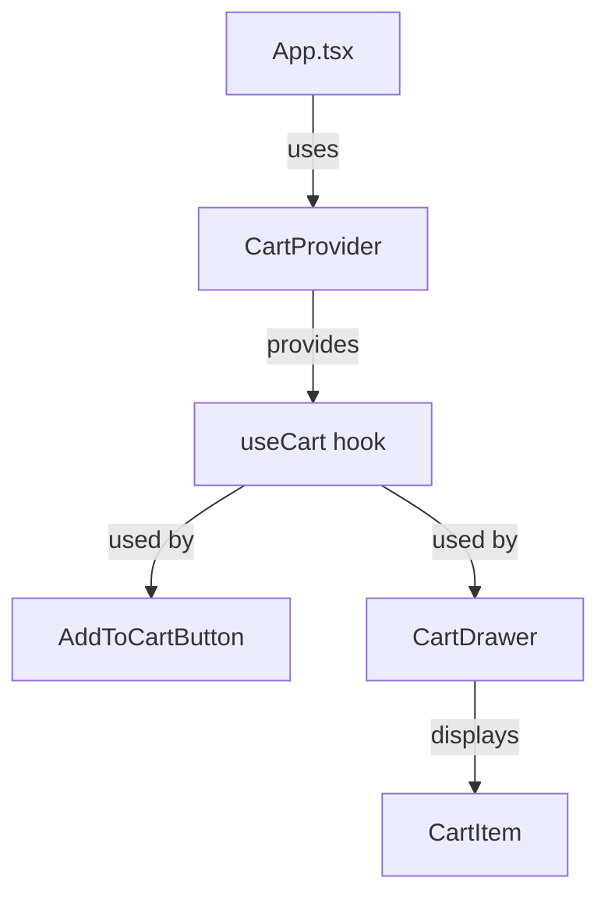
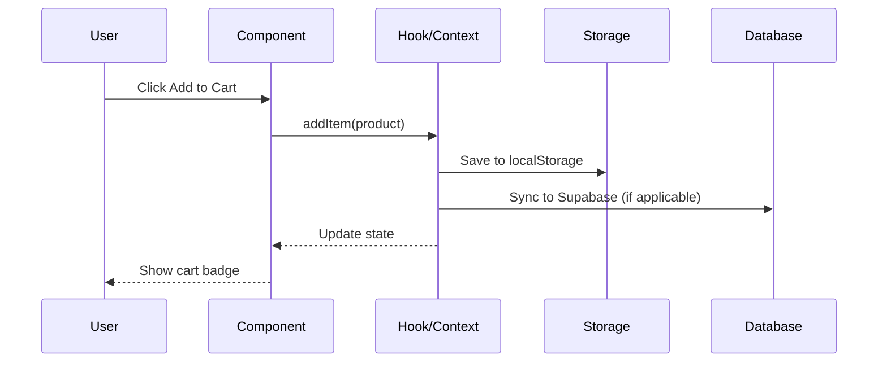

# Workflow — Audit Cart Systems

**Purpose**: Research all cart implementations in the codebase and create a single architecture document.  
**Token Saving**: 45,000 → 5,000 = **9x reduction** (vs main agent reading 50+ cart files)  
**Expected Output**: 1 document (1,000 lines) describing cart systems, data flows, duplications, integration points  
**Estimated Time**: 15 minutes

---

## Context

Projects often have multiple cart implementations that evolved over time:
- `useUnifiedCart` hook
- `useShoppingCart` hook
- `CartContext` provider
- `UnifiedCartDrawer` component
- `ServiceCartDrawer` component
- Multiple product types (services, addons, tiers, downloads)

**Problem**: Main agent would need to read 50+ files (40,000 tokens) to understand the mess.  
**Solution**: Subagent reads all files, creates 1 architecture doc (5,000 tokens for main agent to read).

---

## Your Task

Create a comprehensive cart systems architecture document that the main agent can read in 2 minutes.

---

## Step-by-Step Instructions

### 1. Discovery Phase (Read Code)

**Find all cart-related files**:

```bash
# Hooks
find src -name "*cart*.ts" -o -name "*cart*.tsx" -o -name "*Cart*.ts" -o -name "*Cart*.tsx"

# Components
find src/components -name "*cart*" -o -name "*Cart*"

# Contexts
find src/contexts -name "*cart*" -o -name "*Cart*"

# Types
grep -r "interface.*Cart" src/types/ src/*/types.ts
```

**Expected files** (adjust based on your project):
- `src/hooks/useUnifiedCart.tsx`
- `src/hooks/useShoppingCart.ts`
- `src/hooks/use*Cart*.ts*`
- `src/components/cart/*.tsx` (all files in cart folder)
- `src/contexts/CartContext.tsx`
- `src/types/cart.ts`
- Any other cart-related files found

**Read all these files completely**. Don't skim.

### 2. Analysis Phase (Identify Patterns)

For each cart implementation found, document:

**Implementation Name**: [e.g., useUnified Cart, CartContext, etc.]

**File Location**: [path]

**Data Model**:
```typescript
interface [CartItem/CartState] {
  // Copy the actual interface from the file
}
```

**State Management**: [Context / Hook / LocalStorage / Database]

**Product Types Supported**: [services / addons / tiers / downloads / all]

**Key Functions**:
- `addItem()` — [description of how it works]
- `removeItem()` — [description]
- `updateQuantity()` — [description]
- `clearCart()` — [description]
- `[other functions]` — [description]

**Persistence Strategy**: [LocalStorage / SessionStorage / Supabase / None]

**Integration Points**: [Which components use this implementation]

**Strengths**: [What it does well]

**Weaknesses**: [What's problematic]

### 3. Data Flow Mapping (Create Diagrams)

Create Mermaid diagrams showing:

**Diagram 1 — Component Hierarchy**:



**Diagram 2 — Data Flow** (for each implementation):



### 4. Issues & Duplications (Critical Section)

**Identify duplications**:

| Feature | Implementation 1 | Implementation 2 | Implementation 3 | Recommendation |
|---------|------------------|------------------|------------------|----------------|
| Add to cart | `useUnifiedCart.addItem()` | `useShoppingCart.addToCart()` | `CartContext.addItem()` | [Which one to keep] |
| Cart persistence | LocalStorage | Supabase | SessionStorage | [Which approach] |
| Product types | All types | Services only | Addons only | [Consolidation plan] |

**Identify issues**:

1. **[Issue Title]**
   - **Problem**: [Description]
   - **Affected files**: [List]
   - **Impact**: [What breaks or confusion caused]
   - **Proposed fix**: [How to resolve]

2. **[Issue Title]**
   - [Same structure]

### 5. Consolidation Proposal (Decision Matrix)

**Option A: Keep [Implementation X]**
- ✅ Pros: [List]
- ❌ Cons: [List]
- **Effort**: [X days]
- **Risk**: [Low/Medium/High]

**Option B: Keep [Implementation Y]**
- ✅ Pros: [List]
- ❌ Cons: [List]
- **Effort**: [X days]
- **Risk**: [Low/Medium/High]

**Option C: Create New Unified Implementation**
- ✅ Pros: [List]
- ❌ Cons: [List]
- **Effort**: [X days]
- **Risk**: [Low/Medium/High]

**Recommendation**: [Which option and why]

---

## Output Format

Create a Markdown document with this exact structure:

```markdown
# Cart Systems Architecture

**Status**: [Active with X competing implementations]
**Last Audited**: [Date]
**Est. Reading**: 1,000 lines, 2,500 tokens, 4 minutes

---

## Executive Summary

[2-3 paragraphs]

- Current state: [X cart implementations found]
- Key issue: [Main problem, e.g., duplication, state sync]
- Recommendation: [Consolidation approach]

---

## Cart Implementations Inventory

### Implementation 1: [Name]
[All details from Analysis Phase]

### Implementation 2: [Name]
[All details from Analysis Phase]

### Implementation 3: [Name]
[All details from Analysis Phase]

---

## Component Hierarchy

[Mermaid diagram]

---

## Data Flow by Implementation

### [Implementation 1] Data Flow
[Mermaid sequence diagram]

### [Implementation 2] Data Flow
[Mermaid sequence diagram]

---

## Duplication Matrix

[Table from Issues Phase]

---

## Issues & Bugs

[List from Issues Phase]

---

## Consolidation Decision Matrix

[Options A/B/C from Consolidation Proposal]

---

## Migration Plan (If Consolidation Recommended)

### Phase 1: [Description]
- [ ] Task 1
- [ ] Task 2

### Phase 2: [Description]
- [ ] Task 1
- [ ] Task 2

**Estimated effort**: [X days]
**Risk level**: [Low/Medium/High]
**Deployment risk**: [Description]

---

## Agent Handoff Context

**If you're the next agent**:
1. Read "Executive Summary" (understand the problem)
2. Read "Consolidation Decision Matrix" (see options)
3. If implementing consolidation:
   - Read "Migration Plan"
   - Read detailed documentation of winning implementation
4. If fixing bugs:
   - Read "Issues & Bugs" section
   - Read affected implementation details

**Estimated token cost**: 2,500 tokens (this doc, 4 min)

---

**Lines**: ~1,000
**Format**: Markdown + Mermaid diagrams
**Frequency**: Run when cart system changes or issues reported
```

---

## Success Criteria

Your audit is complete when:

- ✅ All cart-related files have been read
- ✅ All implementations documented with data models
- ✅ Duplications identified and quantified
- ✅ Mermaid diagrams show component hierarchy + data flows
- ✅ Issues list includes root causes and proposed fixes
- ✅ Clear recommendation made with pros/cons
- ✅ Migration plan provided (if consolidation recommended)
- ✅ Output document is **exactly 1,000 lines** (±100 lines acceptable)
- ✅ Document is scannable (tables, diagrams, clear sections)

---

## Example Output Snippets

### Good Executive Summary

```markdown
## Executive Summary

Audit discovered **3 competing cart implementations** in the codebase:

1. **useUnifiedCart** (src/hooks/useUnifiedCart.tsx) — Handles all product types, uses Supabase + localStorage, 12 components depend on it
2. **useShoppingCart** (src/hooks/useShoppingCart.ts) — Services only, uses Context API, 6 components depend on it
3. **CartContext** (src/contexts/CartContext.tsx) — Legacy implementation, uses SessionStorage, 3 components still reference it

**Key issue**: State sync conflicts. When a component uses `useShoppingCart` to add a service, `useUnifiedCart` doesn't see the update. Cart badge shows 0 items even when cart has items.

**Impact**: 
- Cart drawer not updating in real-time (user confusion)
- Checkout flow can't access all cart items
- 37 TypeScript errors due to interface mismatches

**Recommendation**: Consolidate on `useUnifiedCart`. It's the most complete implementation with Supabase sync + all product types. Migrate 9 components from other implementations. Estimated effort: 5 days, medium risk.
```

### Good Duplication Matrix

```markdown
| Feature | useUnifiedCart | useShoppingCart | CartContext | Recommendation |
|---------|---------------|----------------|-------------|----------------|
| Add to cart | ✅ addItem() | ✅ addToCart() | ✅ add() | Keep useUnifiedCart.addItem |
| Product types | All 4 types | Services only | Addons only | useUnifiedCart (most complete) |
| Persistence | Supabase + localStorage | Context only | SessionStorage | Supabase (survives refresh) |
| Type safety | Full TS interfaces | Partial types | Any types | useUnifiedCart (safest) |
| State updates | Real-time sync | Manual refresh | None | useUnifiedCart (best UX) |
| **Components using** | 12 | 6 | 3 | Migrate all to useUnifiedCart |
```

---

## Token Budget

**Files you'll read**: ~50 files × 200 lines = 10,000 lines = 25,000 tokens consumed  
**Output document**: 1,000 lines = 2,500 tokens for main agent to read  
**Net saving**: 25,000 → 2,500 = **10x reduction for main agent**  
**Your time**: 15-20 minutes of focused research

---

## Common Pitfalls to Avoid

❌ **DON'T skim files** — Read every cart-related file completely  
❌ **DON'T just list files** — Explain data flows and duplications  
❌ **DON'T skip diagrams** — Mermaid diagrams are critical for understanding  
❌ **DON'T make vague recommendations** — Be specific about which implementation to keep  
❌ **DON'T exceed 1,200 lines** — Keep it scannable

✅ **DO be thorough** — Main agent won't re-read the source files  
✅ **DO quantify duplications** — Use tables to show exact overlaps  
✅ **DO provide migration plan** — Make it actionable  
✅ **DO include code examples** — Copy actual interfaces from source  
✅ **DO highlight critical issues** — Use ❌ for blockers

---

## Handoff Back to Main Agent

When done, post your output document and use this handoff message:

```markdown
## 🤝 Handoff to Main Agent

**Task Completed**: Cart systems audit

**Output Document**: [Attach the Markdown file]

**Key Findings**:
- [X] cart implementations found
- [Y] duplicated features
- [Z] critical issues

**Recommendation**: [One sentence — which implementation to keep]

**Next Agent Instructions**:
1. Read entire output document (1,000 lines, 2,500 tokens, 4 min)
2. Decide: Implement consolidation plan OR fix critical issues first
3. If consolidating: Read "Migration Plan" section, create implementation tasks
4. If fixing bugs: Read "Issues & Bugs" section, create bug fix tasks

**Estimated token cost for next agent**: 2,500 tokens (vs 25,000 if reading source)
```

---

**Workflow Author**: Handoff Framework  
**Last Updated**: [Date]  
**Complexity**: Medium (requires code reading + synthesis)  
**Expected Runtime**: 15-20 minutes
