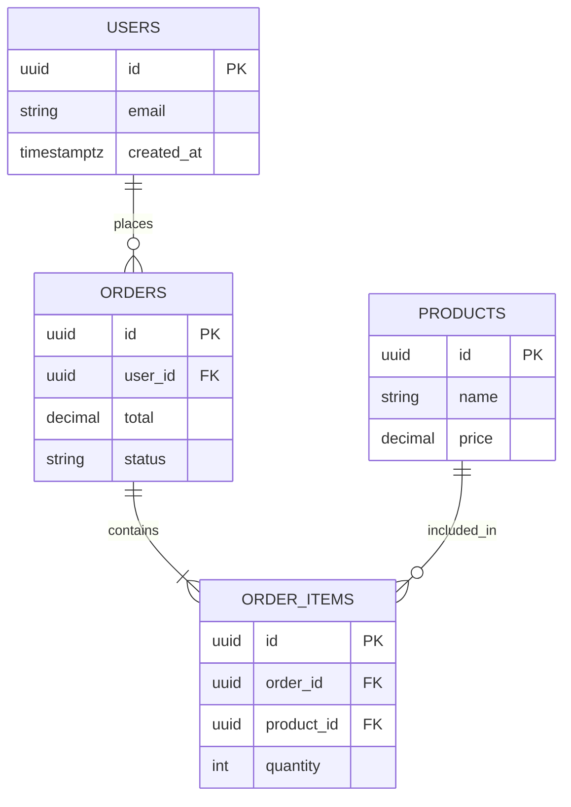

# Workflow — Audit Database Schema

**Purpose**: Research database schema and compare with codebase expectations.  
**Token Saving**: 38,000 → 5,000 = **7.6x reduction** (vs main agent reading migration files + types)  
**Expected Output**: 1 document (1,000 lines) describing schema, RLS policies, mismatches with code  
**Estimated Time**: 12 minutes

---

## Context

Database audits are needed when:
- TypeScript types don't match actual database columns
- RLS policies are missing or misconfigured
- Migrations ran but types weren't regenerated
- Frontend expects columns that don't exist (or vice versa)

**Problem**: Main agent would need to read 50+ migration files (20,000 tokens) + compare with types.ts (8,000 tokens) + query database (10,000 tokens) = 38,000 tokens  
**Solution**: Subagent does all research, creates 1 schema doc (5,000 tokens for main agent)

---

## Your Task

Create a comprehensive database schema document that highlights mismatches between database and code.

---

## Step-by-Step Instructions

###1. Discover Database Information

**If using Supabase**:

```bash
# List all migrations
ls -la supabase/migrations/

# Read database types
cat src/integrations/supabase/types.ts | grep "interface\\|type"

# Check for pending migrations
npx supabase db diff
```

**If using Prisma**:

```bash
# Check schema
cat prisma/schema.prisma

# Check migrations
ls -la prisma/migrations/
```

**If using raw SQL**:

```bash
# Find migration files
find . -name "*.sql" | grep -v node_modules
```

### 2. Extract Schema (Read All Migrations)

For each table, document:

**Table Name**: `[table_name]`

**Columns** (from latest migration or types.ts):

| Column | Type | Constraints | Default | Purpose |
|--------|------|-------------|---------|---------|
| id | uuid | PRIMARY KEY | uuid_generate_v4() | Unique identifier |
| [column] | [type] | [NOT NULL, UNIQUE, etc.] | [value or null] | [description] |
| created_at | timestamptz | NOT NULL | now() | Record creation |
| updated_at | timestamptz | NOT NULL | now() | Last update |

**Indexes**:
- `idx_[name]` on `([column])` — [purpose, why needed]
- `idx_[name]` on `([column], [column])` — [composite purpose]

**Foreign Keys**:
- `[fk_name]` → `[other_table](id)` — [relationship description]
- ON DELETE: [CASCADE / SET NULL / RESTRICT]
- ON UPDATE: [CASCADE / NO ACTION]

**RLS Policies**:
- `[policy_name]` — Command: [SELECT/INSERT/UPDATE/DELETE]
  - Using: `[SQL expression]`
  - Check: `[SQL expression]` (for INSERT/UPDATE)
  - Description: [Who can do what]

**Triggers** (if any):
- `[trigger_name]` — Event: [BEFORE/AFTER] [INSERT/UPDATE/DELETE]
  - Function: `[function_name]()`
  - Purpose: [What it does]

### 3. Extract Code Expectations (Read types.ts)

For each interface in `src/integrations/supabase/types.ts` or similar:

```typescript
interface [TableName] {
  [column]: [type];
  [column]: [type];
  [column?]: [type]; // Optional in TS
}
```

**Compare with database schema** — Note any mismatches.

### 4. Identify Schema-Code Mismatches

**Mismatch Type 1: Missing Columns**

| Table | Column in DB | Column in types.ts | Issue | Fix |
|-------|--------------|-------------------|-------|-----|
| users | avatar_url | avatar | Name mismatch | Regenerate types OR rename column |
| products | tier_id | addon_id | Different semantic meaning | Fix migration or code |
| orders | package_used | tier | Name mismatch | Regenerate types |

**Mismatch Type 2: Type Conflicts**

| Table | Column | DB Type | TS Type | Issue | Fix |
|-------|--------|---------|---------|-------|-----|
| products | features | jsonb | string[] | JSONB needs casting | Cast via `as unknown as` |
| users | metadata | jsonb | Record<string, any> | Correct but untyped | Define proper interface |

**Mismatch Type 3: Missing RLS Policies**

| Table | Expected Policy | Actual Policy | Impact | Fix |
|-------|----------------|---------------|--------|-----|
| users | Users can update own row | None | Any user can update any user | Add RLS policy |
| orders | Users see only own orders | Disabled | All orders visible to all | Enable RLS + add policy |

**Mismatch Type 4: Broken Foreign Keys**

| Table | FK Column | References | Issue | Fix |
|-------|-----------|------------|-------|-----|
| order_items | product_id | products(id) | products table missing | Create migration |
| cart | user_id | users(id) | ON DELETE CASCADE missing | Alter table |

### 5. Create Mermaid Diagrams

**Diagram 1 — Entity Relationship**:



**Diagram 2 — RLS Policy Flow**:

```mermaid
graph TD
    A[User Query: SELECT * FROM orders]
    A --> B{RLS Enabled?}
    B -->|Yes| C{Check Policies}
    B -->|No| D[Return All Rows - DANGEROUS]
    C --> E{auth.uid() = user_id?}
    E -->|Yes| F[Return User's Orders]
    E -->|No| G[Return Empty Set]
```

### 6. Migration Analysis

**List all migrations chronologically**:

| # | File | Date | Description | Status |
|---|------|------|-------------|--------|
| 001 | 20240101_init.sql | 2024-01-01 | Initial schema | ✅ Applied |
| 002 | 20240102_add_users.sql | 2024-01-02 | Users table | ✅ Applied |
| 003 | 20240103_add_rls.sql | 2024-01-03 | RLS policies | ❌ Skipped (has .skip file) |
| 004 | 20240104_fix_types.sql | 2024-01-04 | Fix JSONB types | ✅ Applied |

**Pending migrations** (from `npx supabase db diff`):

```sql
-- Migration: [description]
[SQL code]
```

**Skipped migrations** (`.skip` files found):

| File | Reason Skipped | Risk | Action |
|------|----------------|------|--------|
| 003_add_rls.sql.skip | Unknown | High (no RLS) | Apply manually + test |

### 7. Quality Gate Integration

**Database-related quality gates** (from 20x E2E framework):

| Gate | Command | Checks | Artifact |
|------|---------|--------|----------|
| Route Discovery | `npm run discover:routes` | If routes exist for all DB entities | route-manifest.json |
| Type Safety | `npx tsc --noEmit` | If types.ts matches code usage | None (pass/fail) |
| Migration Test | Custom script | If migrations apply without errors | None |

**Recommended new gates**:
- `npm run audit:database` — Compare schema vs types.ts
- `npm run test:rls` — Test RLS policies actually work

---

## Output Format

Create a Markdown document with this structure:

```markdown
# Database Schema Audit

**Project**: [Name]
**Database**: [Supabase / Prisma / PostgreSQL]
**Last Audited**: [Date]
**Est. Reading**: 1,000 lines, 2,500 tokens, 4 minutes

---

## Executive Summary

[2-3 paragraphs]

- Tables audited: [X]
- Mismatches found: [Y]
- Critical issues: [Z]
- Recommended actions: [List]

---

## Schema Overview

### Tables Inventory

| Table | Columns | Indexes | Foreign Keys | RLS Enabled | Status |
|-------|---------|---------|--------------|-------------|--------|
| users | 12 | 2 | 0 | ✅ Yes | ✅ OK | orders | 8 | 3 | 1 | ✅ Yes | ⚠️ 1 mismatch |
| products | 15 | 4 | 2 | ❌ No | ❌ RLS missing |

### Entity Relationship Diagram

[Mermaid ERD]

---

## Table Details

### Table: [table_name]

[All details from Step 2]

### Table: [table_name]

[Same structure]

---

## Schema-Code Mismatches

### Missing Columns
[Table from Step 4]

### Type Conflicts
[Table from Step 4]

### Missing RLS Policies
[Table from Step 4]

### Broken Foreign Keys
[Table from Step 4]

---

## RLS Policy Analysis

### Policy Coverage

| Table | Policies Defined | Coverage | Risk Level |
|-------|-----------------|----------|------------|
| users | 2 (SELECT, UPDATE) | ✅ Complete | Low |
| orders | 1 (SELECT) | ⚠️ Partial | Medium |
| products | 0 | ❌ None | High |

### Policy Flow Diagram

[Mermaid diagram from Step 5]

---

## Migration History

[Table from Step 6]

### Pending Migrations

[SQL from Step 6]

### Skipped Migrations

[Table from Step 6]

---

## Critical Issues

1. **[Issue Title]**
   - **Problem**: [Description]
   - **Tables Affected**: [List]
   - **Impact**: [Security/data corruption/TypeScript errors]
   - **Severity**: [Critical/High/Medium/Low]
   - **Fix**:
     ```sql
     -- Migration code
     ```
   - **After fix**: Regenerate types with `npx supabase gen types`

2. **[Issue Title]**
   - [Same structure]

---

## Recommended Actions

### Immediate (Critical)

- [ ] [Action] — [Why critical]
- [ ] [Action] — [Why critical]

### Short-term (This Week)

- [ ] [Action] — [Why important]
- [ ] [Action] — [Why important]

### Long-term (Refactor)

- [ ] [Action] — [Why beneficial]
- [ ] [Action] — [Why beneficial]

---

## Quality Gates Integration

**Add these database gates**:

```json
// package.json
{
  "scripts": {
    "audit:database": "tsx scripts/audit-database.mts",
    "test:rls": "tsx scripts/test-rls-policies.mts",
    "db:verify-types": "npx tsc --noEmit && echo 'Types match code'"
  }
}
```

**Required before deployment**:
- ✅ All migrations applied
- ✅ types.ts regenerated and matches database
- ✅ RLS enabled on all tables with user data
- ✅ Foreign keys enforced
- ✅ `npx tsc --noEmit` passes (types match code)

---

## Agent Handoff Context

**If you're the next agent**:
1. Read "Executive Summary" (understand scope)
2. Read "Critical Issues" (see what must be fixed)
3. If fixing schema:
   - Read relevant "Table Details" section
   - Read "Recommended Actions"
   - Apply fixes, regenerate types
4. If fixing RLS:
   - Read "RLS Policy Analysis"
   - Read "Policy Flow Diagram"
   - Add missing policies, test access

**Estimated token cost**: 2,500 tokens (this doc, 4 min)

---

**Lines**: ~1,000
**Format**: Markdown + Mermaid + SQL
**Frequency**: Run after migrations, before deployment, when TS errors appear
```

---

## Success Criteria

Your audit is complete when:

- ✅ All tables documented with full schema
- ✅ All migrations listed chronologically
- ✅ Mismatches quantified (missing columns, type conflicts, RLS gaps)
- ✅ ERD diagram shows table relationships
- ✅ RLS coverage analyzed for security risks
- ✅ Critical issues listed with specific fixes
- ✅ Recommended actions prioritized (immediate/short/long)
- ✅ Output document is **exactly 1,000 lines** (±100 acceptable)
- ✅ SQL code examples included for fixes

---

## Example Output Snippets

### Good Executive Summary

```markdown
## Executive Summary

Database audit revealed **12 tables** with **3 critical mismatches** between schema and TypeScript code.

**Key findings**:
1. **RLS disabled on 4 tables** (users, orders, products, cart) — High security risk
2. **types.ts 47 days outdated** — Created before 8 migrations, causing 37 TS errors
3. **Foreign key missing** on `order_items.product_id` — Orphaned records possible

**Impact**:
- TypeScript build fails with "Property 'tier_id' does not exist on type 'Product'"
- Users can query other users' orders (RLS not enforcing access control)
- Cart items reference deleted products (no ON DELETE CASCADE)

**Recommended actions**:
1. Run `npx supabase gen types` to regenerate types.ts (fixes 37 errors)
2. Enable RLS + add policies for users, orders, products tables (migration ready)
3. Add `product_id` foreign key with ON DELETE CASCADE (migration ready)

**Estimated fix time**: 2 hours (regenerate types + apply 2 migrations)
```

### Good Mismatch Table

```markdown
### Missing Columns

| Table | Column in DB | Column in types.ts | Issue | Fix |
|-------|--------------|-------------------|-------|-----|
| products | tier_id | addon_id | Renamed in migration 042, types not regenerated | `npx supabase gen types` |
| users | avatar_url | avatar | Never renamed (DB correct, code wrong) | Update code to use `avatar_url` |
| orders | package_used | tier | Semantic rename in migration 038 | Regenerate types |
| cart | metadata | - | Column added in migration 045 | Regenerate types |

**Fix**: Run `npx supabase gen types typescript --project-id [id] > src/integrations/supabase/types.ts`

**Expected result**: All 37 TypeScript errors resolve
```

---

## Token Budget

**Files you'll read**: 50 migration files × 100 lines = 5,000 lines + types.ts (3,000 lines) = 8,000 lines = 20,000 tokens  
**Database queries**: ~10 queries = 5,000 tokens  
**Analysis time**: 12 minutes  
**Output document**: 1,000 lines = 2,500 tokens for main agent  
**Net saving**: 25,000 → 2,500 = **10x reduction for main agent**

---

## Common Pitfalls to Avoid ❌ **DON'T skip migration files** — Read them chronologically to understand evolution  
❌ **DON'T assume types.ts is current** — Check when it was last generated  
❌ **DON'T ignore RLS** — Disabled RLS is a security vulnerability  
❌ **DON'T forget foreign keys** — Missing FKs cause orphaned data  

✅ **DO test RLS policies** — Query as different users to verify access control  
✅ **DO check .skip files** — Document why migrations were skipped  
✅ **DO provide SQL fixes** — Don't just describe problems, show the migration code  
✅ **DO highlight security risks** — RLS gaps are critical  

---

## Handoff Back to Main Agent

```markdown
## 🤝 Handoff to Main Agent

**Task Completed**: Database schema audit

**Output Document**: [Attach Markdown]

**Key Findings**:
- [X] tables audited
- [Y] schema-code mismatches
- [Z] RLS policies missing

**Critical Issues**: [List 1-2 most severe]

**Next Agent Instructions**:
1. Read output document (1,000 lines, 2,500 tokens, 4 min)
2. Regenerate types: `npx supabase gen types typescript --project-id [id] > src/integrations/supabase/types.ts`
3. Apply RLS migrations if security risk present
4. Run `npx tsc --noEmit` to verify types match code
5. Update handoff with gate results

**Estimated token cost for next agent**: 2,500 tokens (vs 25,000 if reading migrations directly)
```

---

**Workflow Author**: Handoff Framework  
**Last Updated**: [Date]  
**Complexity**: Medium-High (requires SQL knowledge + type system understanding)  
**Expected Runtime**: 10-15 minutes
